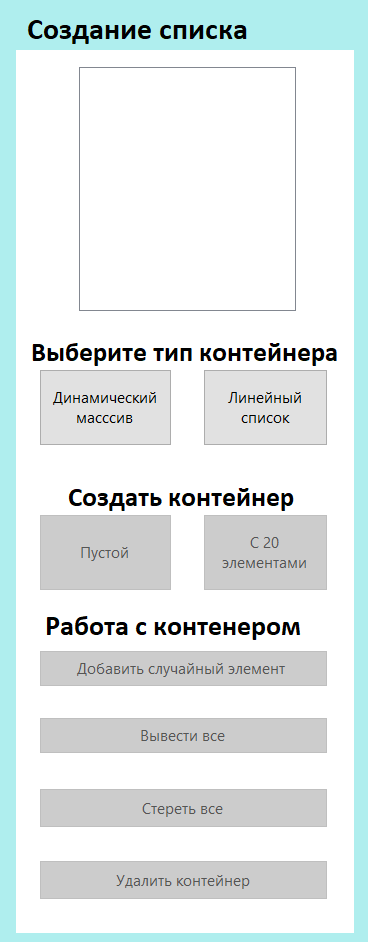
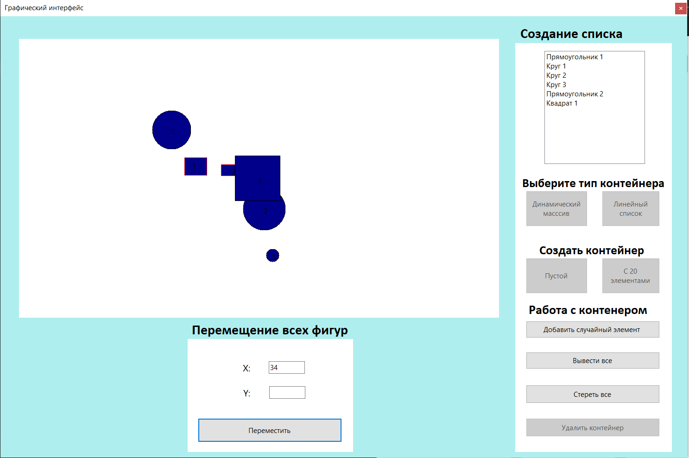

# Работа с контейнерами фигур
_Пользователь имеет возможность создавать контейнер фигур либо на основе динамического массива, либо на основе линейного списка_
>___Работа с отдельными фигурами или классами фигур не предполагается___

[Ссылка на страницу о C# в википедии](https://ru.wikipedia.org/wiki/C_Sharp)
___
### 1. На основе динамического массива
Выберете кнопку "Динамический массив". После нажатия на эту кнопку появляется сам список, а также возможность отрисовать фигуры, добавить фигуру в конец массива или удалить массив. Отрисовка заблокирует возможность удаления массива, но активируется кнопка "Стереть фигуры". 



Также имеется возможность двигать все фигуры на определённое количество пикселей


Пример работы программы:



__Класс FiguresArray:__
```
class FiguresArray
    {
        private TFigure[] array;
        private int length = 0;
        public FiguresArray()
        {
            array = new TFigure[0];
        }

        public FiguresArray(int length, ref string[] strs)
        {
            this.length = length;
            array = new TFigure[length];
            Random rand = new Random();
            Array.Resize(ref strs, length);
            for (int i = 0, circs = 0, sqrs = 0, rects = 0, ells = 0, rhombs = 0, trs = 0; i < length; i++)
            {
                switch (rand.Next(0, 6))
                {
                    case 0:
                        circs++;
                        array[i] = new Circle();
                        strs[i] = "Круг " + circs;
                        break;
                    case 1:
                        sqrs++;
                        array[i] = new Square();
                        strs[i] = "Квадрат " + sqrs;
                        break;
                    case 2:
                        rects++;
                        array[i] = new Rects();
                        strs[i] = "Прямоугольник " + rects;
                        break;
                    case 3:
                        ells++;
                        array[i] = new Ellipse();
                        strs[i] = "Эллипс " + ells;
                        break;
                    case 4:
                        rhombs++;
                        array[i] = new Rhomb();
                        strs[i] = "Ромб " + rhombs;
                        break;
                    case 5:
                        trs++;
                        array[i] = new Trapezoid();
                        strs[i] = "Трапеция " + trs;
                        break;
                }
            }
        }

        public void Show(PictureBox canvas, Bitmap bitmap)
        {
            for (int i = 0, circs = 0, sqrs = 0, rects = 0, ells = 0, rhombs = 0, trs = 0; i < length; i++)
            {
                if (array[i] is Trapezoid trap)
                {
                    trs++;
                    trap.Show(trs, canvas, bitmap);
                }
                else if (array[i] is Rhomb rhomb)
                {
                    rhombs++;
                    rhomb.Show(rhombs, canvas, bitmap);
                }
                else if (array[i] is Ellipse ell)
                {
                    ells++;
                    ell.Show(ells, canvas, bitmap);
                }
                else if (array[i] is Rects rect)
                {
                    rects++;
                    rect.Show(rects, canvas, bitmap);
                }
                else if (array[i] is Square sqr)
                {
                    sqrs++;
                    sqr.Show(sqrs, canvas, bitmap);
                }
                else if (array[i] is Circle circ)
                {
                    circs++;
                    circ.Show(circs, canvas, bitmap);
                }
            }
        }

        public void Erase(PictureBox canvas, Bitmap bitmap)
        {
            for (int i = 0; i < length; i++)
            {
                array[i].Delete(canvas,bitmap);
            }
        }

        public void Move(PictureBox canvas, Bitmap bitmap, int dx, int dy)
        {
            for (int i = 0; i < length; i++)
            {
                array[i].ToMove(dx,dy,canvas, bitmap);
            }
        }

        public void Add(ref string[] strs)
        {
            Array.Resize(ref array, length + 1);
            Array.Resize(ref strs, length + 1);
            Random rand = new Random();
            TFigure figure;
            switch (rand.Next(0, 6))
            {
                case 0:
                    figure = new Circle();
                    break;
                case 1:
                    figure = new Square();
                    break;
                case 2:
                    figure = new Rects();
                    break;
                case 3:
                    figure = new Ellipse();
                    break;
                case 4:
                    figure = new Rhomb();
                    break;
                case 5:
                    figure = new Trapezoid();
                    break;
                default:
                    figure = new Circle();
                    break;
            }
            array[length] = figure;
            length++;
            for (int i = 0, circs = 0, sqrs = 0, rects = 0, ells = 0, rhombs = 0, trs = 0; i < length; i++)
            {
                if (array[i] is Trapezoid)
                {
                    trs++;
                    strs[i] = "Трапеция " + trs;
                }
                else if (array[i] is Rhomb)
                {
                    rhombs++;
                    strs[i] = "Ромб " + rhombs;
                }
                else if (array[i] is Ellipse)
                {
                    ells++;
                    strs[i] = "Эллипс " + ells;
                }
                else if (array[i] is Rects)
                {
                    rects++;
                    strs[i] = "Прямоугольник " + rects;
                }
                else if (array[i] is Square)
                {
                    sqrs++;
                    strs[i] = "Квадрат " + sqrs;
                }
                else if (array[i] is Circle)
                {
                    circs++;
                    strs[i] = "Круг " + circs;
                }
            }
        }

        public void Delete()
        {
            Array.Clear(array,0,length);
            array = null;
            length = 0;
        }
    }
}
```
___
### 2. На основе линейного списка

Для работы со списком нажмите на кнопку "Линейный список". Остальной функционал совпадает с предыдущим пунктом.

__Код класса FigureList:__
```
class FigureList
    {
        private Node head;
        private Node tail;
        private int length = 0;
        public FigureList()
        {

        }

        public FigureList(int length,ref string[] strs)
        {
            Random rand = new Random();
            this.length = length;
            Array.Resize(ref strs, length);
            for (int i = 0, circs = 0, sqrs = 0, rects = 0, ells = 0, rhombs = 0, trs = 0; i < length; i++)
            {
                switch (rand.Next(0, 6))
                {
                    case 0:
                        circs++;
                        Append(new Circle());
                        strs[i] = "Круг " + circs;
                        break;
                    case 1:
                        sqrs++;
                        Append(new Square());
                        strs[i] = "Квадрат " + sqrs;
                        break;
                    case 2:
                        rects++;
                        Append(new Rects());
                        strs[i] = "Прямоугольник " + rects;
                        break;
                    case 3:
                        ells++;
                        Append(new Ellipse());
                        strs[i] = "Эллипс " + ells;
                        break;
                    case 4:
                        rhombs++;
                        Append(new Rhomb());
                        strs[i] = "Ромб " + rhombs;
                        break;
                    case 5:
                        trs++;
                        Append(new Trapezoid());
                        strs[i] = "Трапеция " + trs;
                        break;
                }
            }
        }

        private void Append(TFigure figure)
        {
            Node node = new Node(figure);

            if (head == null)
                head = node;
            else
                tail.Next = node;
            tail = node;
        }

        public void Show(PictureBox canvas, Bitmap bitmap)
        {
            Node p = head;
            
            for (int i = 0, circs = 0, sqrs = 0, rects = 0, ells = 0, rhombs = 0, trs = 0; i < length; i++)
            {
                TFigure figure = p.Figure;
                if (figure is Trapezoid trap)
                {
                    trs++;
                    trap.Show(trs, canvas, bitmap);
                }
                else if (figure is Rhomb rhomb)
                {
                    rhombs++;
                    rhomb.Show(rhombs, canvas, bitmap);
                }
                else if (figure is Ellipse ell)
                {
                    ells++;
                    ell.Show(ells, canvas, bitmap);
                }
                else if (figure is Rects rect)
                {
                    rects++;
                    rect.Show(rects, canvas, bitmap);
                }
                else if (figure is Square sqr)
                {
                    sqrs++;
                    sqr.Show(sqrs, canvas, bitmap);
                }
                else if (figure is Circle circ)
                {
                    circs++;
                    circ.Show(circs, canvas, bitmap);
                }
                
                p = p.Next;
            }
        }

        public void Add(ref string[] strs)
        {
            Random rand = new Random();
            switch (rand.Next(0, 6))
            {
                case 0:
                    Append(new Circle());
                    break;
                case 1:
                    Append(new Square());
                    break;
                case 2:
                    Append(new Rects());
                    break;
                case 3:
                    Append(new Ellipse());
                    break;
                case 4:
                    Append(new Rhomb());
                    break;
                case 5:
                    Append(new Trapezoid());
                    break;
            }
            
            length++;
            Array.Resize(ref strs,length);

            Node p = head;
            for (int i = 0, circs = 0, sqrs = 0, rects = 0, ells = 0, rhombs = 0, trs = 0; i < length; i++)
            {
                TFigure figure = p.Figure;
                if (figure is Trapezoid)
                {
                    trs++;
                    strs[i] = "Трапеция " + trs;
                }
                else if (figure is Rhomb)
                {
                    rhombs++;
                    strs[i] = "Ромб " + rhombs;
                }
                else if (figure is Ellipse)
                {
                    ells++;
                    strs[i] = "Эллипс " + ells;
                }
                else if (figure is Rects)
                {
                    rects++;
                    strs[i] = "Прямоугольник " + rects;
                }
                else if (figure is Square)
                {
                    sqrs++;
                    strs[i] = "Квадрат " + sqrs;
                }
                else if (figure is Circle)
                {
                    circs++;
                    strs[i] = "Круг " + circs;
                }
                p = p.Next;
            }
        }

        public void Erase(PictureBox canvas, Bitmap bitmap)
        {
            Node p = head;
            for (int i = 0; i < length; i++)
            {
                TFigure figure = p.Figure;
                figure.Delete(canvas, bitmap);
                p = p.Next;
            }
        }

        public void Move(PictureBox canvas, Bitmap bitmap, int dx, int dy)
        {
            Node p = head;
            for (int i = 0; i < length; i++)
            {
                TFigure figure = p.Figure;
                figure.ToMove(dx, dy, canvas, bitmap);
                p = p.Next; 
            }
        }

        public void Delete()
        {
            while (length != 0)
            {
                Node p = head;
                head = p.Next;
                p.Figure = null;
                p = null;
                length--;
            }
            length = 0;
            head = null;
            tail = null;
        }
    }
```
__Класс Node:__
```
class Node
    {
        public TFigure Figure { get; set; }
        public Node Next { get; set; }

        public Node(TFigure figure)
        {
            Figure = figure;
        }
    }
```
